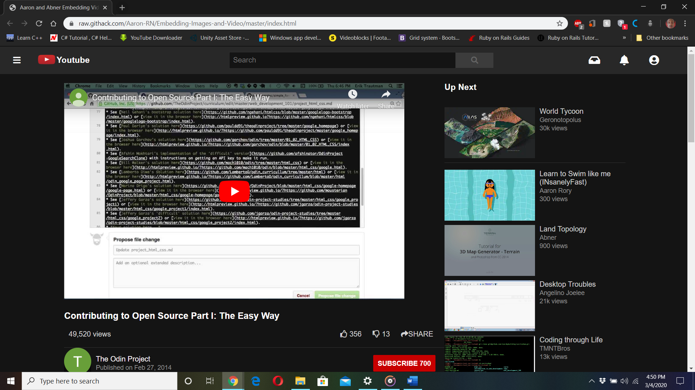

# PROJECT: EMBEDDING IMAGES AND VIDEOS
### Project Description
The goal here isn’t to produce an exact replica of the YouTube video page, but to focus on making the media elements show up.
That means two things – embedding the YouTube video player into the page so it actually plays and showing little thumbnail images 
along the right side.)

### [Live Demo Link](https://raw.githack.com/Aaron-RN/Embedding-Images-and-Video/master/index.html)

## Authors

👤 **Aaron Rory**

- Github: [@Aaron-RN](https://github.com/Aaron-RN)
- Twitter: [@ARNewbold](https://twitter.com/ARNewbold)
- Linkedin: [Aaron Newbold](https://www.linkedin.com/in/aaron-newbold-1b9233187/)

👤 **Abner Eliel Rivera Tinoco**

- Github: [@Abner21](https://github.com/Abner21)

## 🤝 Contributing

Contributions, issues and feature requests are welcome!

Feel free to check the [issues page](issues/).

## Show your support

Give a ⭐️ if you like this project!

## 📝 License

This project is [MIT](lic.url) licensed.
